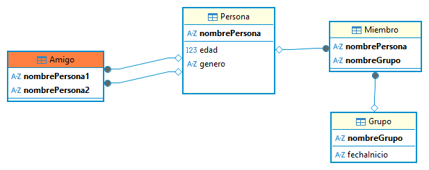
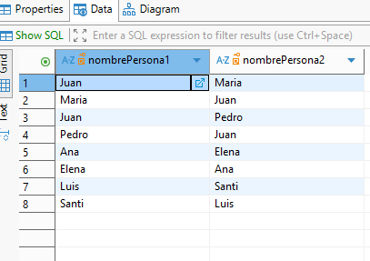
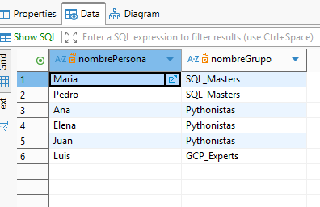
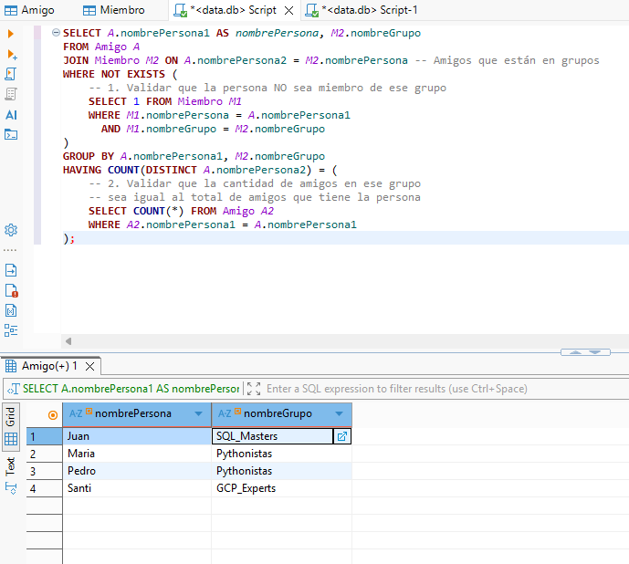

# 2 - Consulta SQL

## Descripción
En este proyecto, se provee una base de datos con dos tablas: `Amigo` y `Miembro`, y con tablas adicionales como `Persona` y `Grupo`.
La tabla `Amigo` contiene información sobre las amistades entre personas, mientras que la tabla `Miembro` contiene información sobre los grupos a los que pertenecen esas personas.

La consulta SQL debe dar el nombre de cada persona junto con el nombre del grupo al que pertenece, pero solo si todos sus amigos también pertenecen a ese mismo grupo.

### Modelo Entidad Relación


### Lógica de Resolución
Para resolver este problema, aplicamos la Teoría de Conjuntos mediante una "Diferencia de Conjuntos" y una validación de "Universalidad".

La lógica se divide en dos filtros críticos:

- Filtro de Exclusión: La persona A no debe existir en la tabla Miembro para el grupo G.

- Filtro de Totalidad: La cantidad de amigos de A que están en G debe ser igual al total de amigos que tiene A.

## Ejecución Rápida
- Al tener Python instalado, es posible clonar y ver el resultado del proyecto con un solo comando:

```Bash
python main.py
```

Este script inicializa una base de datos en memoria (o archivo), carga el esquema desarrollado en función del DER `sql/schema.sql`, inserta 20 registros de prueba y ejecuta la consulta SQL.

- Para probar directamente la consulta SQL contra la DB data.db usar:
```Bash
sqlite3 data/data.db < sql/consulta.sql
```
La consulta que resuelve ésta situación ya se encuentra cargada en `sql/consulta.sql`

## Ejemplo de Ejecución y Resultado
### Tabla Amigo



### Tabla Miembro



### Resultado Esperado
Aquí se observa la consulta en el editor SQL con los comentarios necesarios para aclarar su funcionamiento y debajo el resultado de la ejecución de la misma.




